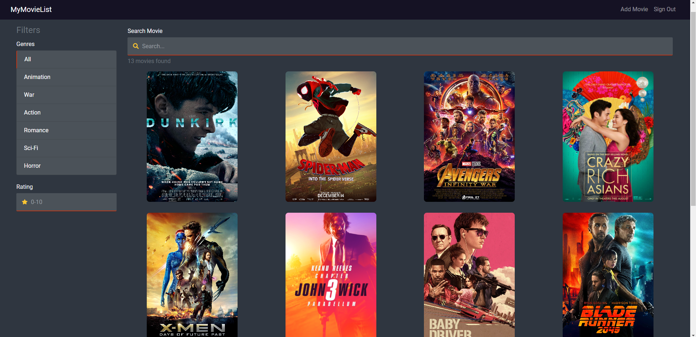
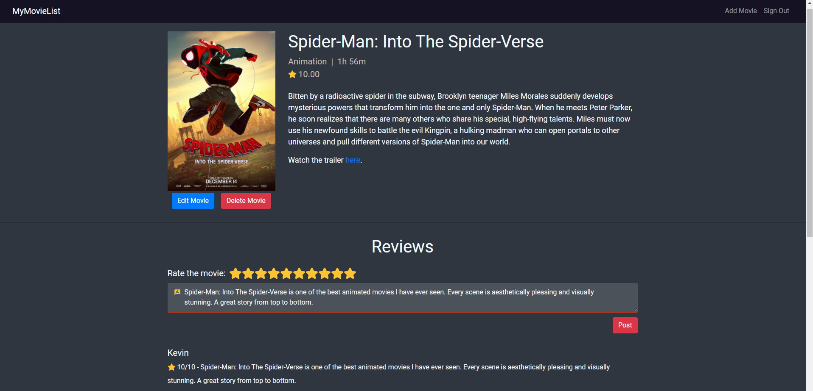

# MyMovieList
MyMovieList is a simple database web app where users can search for movies and review and rate movies, and admins can add, update, or delete movies.

<b>Website: </b> <a href="https://mymovielist-kevin.herokuapp.com">https://mymovielist-kevin.herokuapp.com</a>

<b>Home Page</b>

</br>
</br>
<b>Movie Info Page</b>


<h2>Installation</h2>

 Setup the project and install the packages by running:
```bash
npm run setup
```
 Run project with command:
```bash
npm run dev
```

<h2>Built with</h2>
<ul>
    <li>FrontEnd: <b> React.JS, Bootstrap, HTML/CSS </b></li>
    <li>Backend:  <b> Node.JS, Express.JS, Passport.JS, Bcrypt</b> </li>
    <li>Database: <b> MongoDB, Mongoose </b> </li>
</ul>

<h2> Features </h2>
<ul>
    <li> User Registration, Login, and Logout.</li>
    <li> Search movies using title/genre/rating filters.</li>
    <li> Rate or review movies.</li>
    <li> Add, update, or delete movies.</li>
</ul>

<h2> API </h2>
<h4> Users </h4>
<ul>
  <li> <b>POST</b> /api/users/register </li>
  <li> <b>POST</b>  /api/users/signin  </li>
  <li> <b>GET</b>  /api/users/signout </li>
  <li> <b>GET</b>  /api/users/checkAuth </li>
  <li> <b>GET</b>  /api/users/checkAdmin </li>
</ul>

<h4> Movies </h4>
<ul>
  <li> <b>POST</b> /api/movie/new </li>
  <li> <b>GET</b> /api/movie </li>
  <li> <b>GET</b> /api/movie/:id </li>
  <li> <b>GET</b> /api/movie/rating/:id </li>
  <li> <b>DELETE</b> /api/movie/:id </li>
  <li> <b>PUT</b> /api/movie/:id </li>
</ul>

<h4> Reviews </h4>
<ul>
  <li> <b>GET</b> /api/review/user/:id </li>
  <li> <b>GET</b> /api/review/movie/:id </li>
  <li> <b>POST</b> /api/review/new </li>
</ul>

<h4> Genres </h4>
<ul>
  <li> <b>GET</b> /api/genre </li>
</ul>

<h2> Heroku </h2>
This web app is hosted on Heroku. "The Heroku filesystem is ephemeral - that means that any changes to the filesystem whilst the dyno is running only last until that dyno is shut down or restarted" (<a href="https://help.heroku.com/K1PPS2WM/why-are-my-file-uploads-missing-deleted">Source</a>). As a result, images can not be stored in a filesystem without it being deleted after a server shut down or restart. A solution to this problem is to store the images on MongoDB. This is not ideal, but it is the easiest free solution to this problem.

## TODOS

- [x] Home Page (Movies)
  - [x] Genre Filter
  - [x] Rating Filter
  - [x] Search Filter
  - [x] Movie Grid
    - [x] MovieCardS
    - [x] Pagination

- [x] Add Movie Page
  - [x] Form
  - [x] Create Movie

- [x] Movie Page
  - [x] Movie Information
  - [x] Create/Fetch Reviews
  - [x] Create/Fetch Ratings
  - [x] Edit Movie
  - [x] Delete Movie

- [x] Login/Register Page
  - [x] Form
  - [x] Create New User
  - [x] User Authentication
  - [x] Admin Authentication

- [x] Admin features
  - [x] Create movies
  - [x] Delete movies
  - [x] Edit movies

- [x] User Features
  - [x] Review movies
  - [x] Rate movies